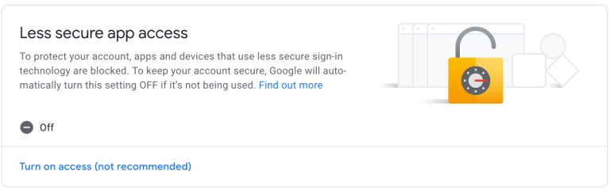

# Email Sender Module

## works with Nodemailer (free) and Sendgrid (free with limits)


### MODELO DE ENVIO PARA NODEMAILER
  ```
            //reemplace variables de entorno creando un archivo .env

            const config = {
                user: process.env.GMAIL_FOR_NODEMAILER_USER,
                pass: process.env.GMAIL_PASSWORD_FOR_NODEMAILER,
                service: 'nodemailer'
            }
            const emailSender = await crearEmailSender(config)
            const mail = {
                from: config.user,
                to: 'alguien@gmail.com',
                subject: 'Send from My Module!!',
                text: 'hello Moto!',
                attachmentsPaths: ['./test/assets/ejemplo.pdf']
            }
            const recibido = await emailSender.sendEmail(mail)
           console.log('enviado:' + recibido)
  ```         
#### IMPORTANTE:
           *** Para poder enviar emails debe configurar manualmente su cuenta de Gmail
           *** ingresando a su cuenta Gmail y descativando la opción "Less Secure Apps"
           *** vaya a -> Google Account -> Security -> Less Secure Apps 




### MODELO DE ENVIO PARA SENDGRID
```
         //reemplace variables de entorno creando un archivo .env
        //Apikey se obtiene registrándose en la página de Sendgrid/Twilio

        const config = {
            apiKey: process.env.SENDGRID_API_KEY,
            service: 'sendgrid' 
        }
        const email = {
            from: 'eliseoabelcarh3@gmail.com', // debe ser el mismo email registrado en sendgrid
            to: 'eliseoabelcarh1@gmail.com',
            subject: 'Hi!!',
            html: '<strong>Esto es un mensaje</strong>'
        }
        const arrayConPathDeArchivos = ['./test/assets/ejemplo.pdf']
        const esperado = true
        const sender = await crearEmailSender(config)

        const respuesta1 = await sender.sendEmail(email.from, email.to, email.subject, email.html, arrayConPathDeArchivos)
        assert.deepStrictEqual(respuesta1, esperado)
```
#### IMPORTANTE:
 
        *** ApiKey y el email (remitente), deben coincidir con la cuenta registrada en Sendgrid
